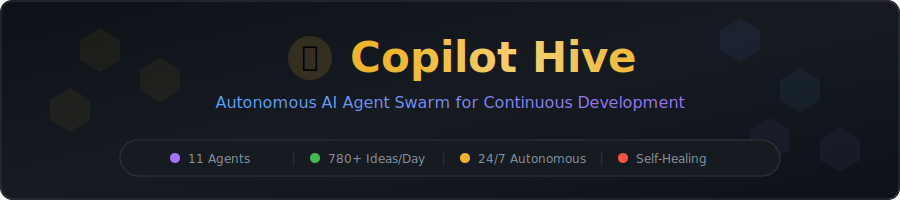
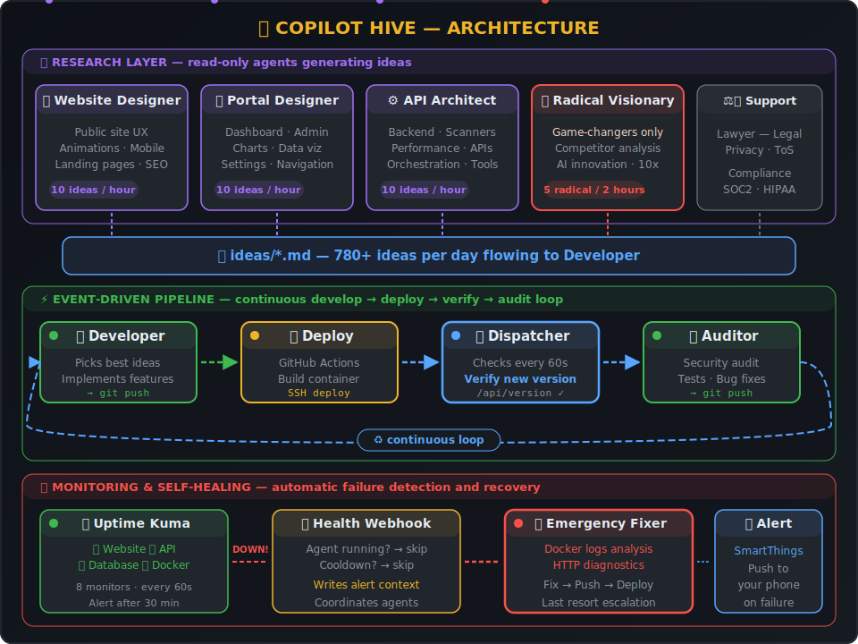
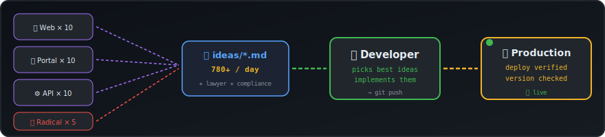
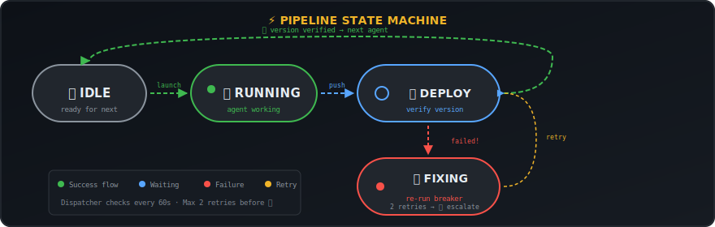

<div align="center">

<picture>
  <source media="(prefers-color-scheme: dark)" srcset="assets/banner.svg">
  <source media="(prefers-color-scheme: light)" srcset="assets/banner.svg">
  
</picture>

<br/><br/>

[](#-the-hive---11-agents)
[](#-event-driven-pipeline)
[](#-idea-flow)
[](#-health-monitoring--self-healing)
[](#-version-verification)

<br/>

*"What if your entire engineering team was AI — and never slept?"*

**Copilot Hive** is an open-source framework for running **11 specialized GitHub Copilot CLI agents** as an autonomous development team. They research ideas, implement features, audit code, deploy changes, and fix failures — all without human intervention, 24/7.

[Architecture](#-architecture) · [Agents](#-the-hive---11-agents) · [Pipeline](#-event-driven-pipeline) · [Self-Healing](#-smart-failure-coordination) · [Get Started](#-getting-started)

</div>

---

## 🏗️ Architecture

<div align="center">

</div>

<br/>

Three layers work together:

| Layer | Agents | Purpose |
|:------|:-------|:--------|
| 🔬 **Research** | 6 read-only agents | Generate 780+ structured ideas per day |
| ⚡ **Pipeline** | Developer ↔ Auditor | Implement → Deploy → Verify → Audit → Loop |
| 🛡️ **Emergency** | Fixer + Kuma + SmartThings | Monitor, self-heal, alert on failures |

---

## 🐝 The Hive — 11 Agents

### 🔧 Code-Modifying Agents

> These are the only agents that touch the codebase. They chain through the event-driven pipeline.

| | Agent | What It Does | Trigger |
|:--|:------|:------------|:--------|
| 🔧 | **Developer** | Reads ALL idea files, implements the best ones, pushes to GitHub | Pipeline (continuous) |
| 🔍 | **Auditor** | Security audit, tests, bug fixes, code quality review | Pipeline (after Developer) |
| 🚑 | **Emergency Fixer** | Reads Docker logs + HTTP diagnostics, fixes critical issues | On failure (escalation) |

### 🔬 Research Agents

> Read-only — they analyze the codebase and competitors, then write structured idea documents. Never modify code.

| | Agent | Focus Area | Output | Schedule |
|:--|:------|:----------|:-------|:---------|
| 🎨 | **Website Designer** | Public site UX, animations, landing pages, mobile, conversions | **10 ideas** | ⏱️ Every hour |
| 🖥️ | **Portal Designer** | Dashboard, admin panel, charts, data viz, user settings | **10 ideas** | ⏱️ Every hour |
| ⚙️ | **API Architect** | API design, scanners, orchestration, performance, new tools | **10 ideas** | ⏱️ Every hour |
| 🔥 | **Radical Visionary** | Game-changers — competitor analysis, AI innovation, disruption | **5 transformative** | ⏱️ Every 2h |
| ⚖️ | **Lawyer** | Privacy policies, ToS, legal compliance, competitor legal | 5 ideas | ⏱️ Every 2h |
| 📋 | **Compliance** | SOC2, PCI-DSS, HIPAA, ISO 27001 readiness | 5 ideas | ⏱️ Every 2h |

### 📊 Support

| | Agent | What It Does | Schedule |
|:--|:------|:------------|:---------|
| 📧 | **Reporter** | Sends HTML email summaries of all agent activity | Daily + Weekly |
| 🚀 | **Deployer** | GitHub Actions — builds Docker images, deploys via SSH | On git push |

---

## 💡 Idea Flow

<div align="center">

</div>

<br/>

Research agents write structured markdown files to `ideas/`. The Developer reads **all 6 files** and picks the highest-impact ideas to implement:

```
ideas/web_design_latest.md    ─┐
ideas/portal_design_latest.md  │
ideas/api_architect_latest.md  ├──▶  🔧 Developer picks best ideas
ideas/radical_latest.md        │     implements → pushes → deploys
ideas/lawyer_latest.md         │
ideas/compliance_latest.md    ─┘
```

<table>
<tr><td align="center"><strong>Per Hour</strong></td><td>30 specialist ideas (10 web + 10 portal + 10 api)</td></tr>
<tr><td align="center"><strong>Per 2 Hours</strong></td><td>+ 15 strategic ideas (5 radical + 5 lawyer + 5 compliance)</td></tr>
<tr><td align="center"><strong>Per Day</strong></td><td><strong>~780 total ideas</strong> feeding the Developer agent</td></tr>
</table>

---

## ⚡ Event-Driven Pipeline

<div align="center">

</div>

<br/>

The **Dispatcher** (`copilot-dispatcher.sh`) runs **every 60 seconds** via cron and orchestrates the continuous Developer ↔ Auditor loop:

| State | What's Happening |
|:------|:----------------|
| 💤 **Idle** | Ready to launch next agent in the chain |
| 🔧 **Running** | Agent is actively working (PID tracked, monitored) |
| ⏳ **Deploy** | Code pushed — waiting for GitHub Actions + Docker deploy + version verification |
| 🔧 **Fixing** | Deploy failed — re-running the agent that broke it (2 retries before 🚑 escalation) |

### What a Cycle Looks Like

```
07:01  📡 Dispatcher → launches Developer
07:35  🔧 Developer → implements 3 features from idea files
07:36  🔧 Developer → stamps build-id, pushes to GitHub
07:37  🚀 GitHub Actions → builds container, deploys via SSH
07:39  📡 Dispatcher → calls /api/version → confirms NEW container is live ✅
07:39  📡 Dispatcher → launches Auditor
08:05  🔍 Auditor → finds 2 security issues, fixes them
08:06  🔍 Auditor → stamps build-id, pushes to GitHub
08:08  📡 Dispatcher → version verified ✅ → launches Developer
08:08  ♻️  New cycle begins...
```

---

## 🔖 Version Verification

> *"Did the deploy actually work?"* — Copilot Hive doesn't just check if a container is running. It verifies the **exact version** matches.

**1. Agent stamps a unique build ID before committing:**

```bash
BUILD_ID="$(date +%s)-$(openssl rand -hex 4)"
echo "$BUILD_ID" > .build-id
git add -A && git commit && git push
```

**2. App exposes it via API:**

```json
GET /api/version → {"build_id": "1740234567-a1b2c3d4", "status": "running"}
```

**3. Dispatcher verifies after deploy:**

```bash
RUNNING=$(curl -s localhost:8080/api/version | jq -r '.build_id')
[ "$RUNNING" = "$EXPECTED" ] && echo "✅ New container live" || echo "⏳ Still deploying..."
```

This prevents the next agent from working against stale code when a deploy fails silently.

---

## 🛡️ Smart Failure Coordination

When a deploy breaks, the system follows an intelligent escalation path — the **agent that broke things gets first chance to fix it**:

```
  Deploy Failed!
       │
       ▼
  ┌──────────────────────────────────┐
  │  Re-run the SAME agent that      │  ← It has context about
  │  pushed the bad code (attempt 1)  │    what it changed
  └──────────────┬───────────────────┘
                 │
            Fixed? ─── Yes ──▶ ✅ Continue pipeline
                 │
                 No
                 │
  ┌──────────────┴───────────────────┐
  │  Re-run same agent (attempt 2)    │
  └──────────────┬───────────────────┘
                 │
            Fixed? ─── Yes ──▶ ✅ Continue pipeline
                 │
                 No (escalate!)
                 │
  ┌──────────────▼───────────────────┐
  │  🚑 EMERGENCY FIXER              │
  │                                   │
  │  Gets full diagnostics:           │
  │  • Docker container logs          │
  │  • Container health status        │
  │  • HTTP response codes            │
  │  • GitHub Actions build logs      │
  │  • What the previous agent tried  │
  └───────────────────────────────────┘
```

---

## 🏥 Health Monitoring & Self-Healing

### Uptime Kuma

[Uptime Kuma](https://github.com/louislam/uptime-kuma) monitors all services with dashboards and history:

| Monitor | Type | Target | Interval |
|:--------|:-----|:-------|:---------|
| Website | HTTP | port 80 | 60s |
| API Health | HTTP | `/health` | 60s |
| API Version | HTTP | `/api/version` | 60s |
| External | HTTPS | your domain | 60s |
| Database | TCP | port 5432 | 60s |
| Web Container | Docker | container status | 60s |
| API Container | Docker | container status | 60s |
| DB Container | Docker | container status | 60s |

> **Alert threshold: 30 minutes** — if a service is down for 30 consecutive checks, the webhook fires.

### Webhook → Emergency Fixer Flow

```
Uptime Kuma detects service DOWN for 30 min
         │
         ├── Is an agent already working on it? → Skip
         ├── Cooldown active (10 min)? → Skip
         │
         ├── Write .alert-context.json (monitor, error, pipeline state)
         └── Launch 🚑 Emergency Fixer with full context
```

---

## 📱 SmartThings Notifications

Agents send push notifications to your phone via Samsung SmartThings:

```
Agent fails → notify-smartthings.sh → Toggle CopilotAlert switch
→ SmartThings Automation → Push notification to phone 📱
```

---

## 🚨 Urgent Idea System

Need something implemented **right now**? Submit an urgent idea to `ideas/admin_ideas.json`:

```json
{ "title": "Add rate limiting", "urgent": true, "status": "pending" }
```

**Every agent** checks for urgent ideas at startup. The very next agent to run — whether it's the Website Designer, Lawyer, or Compliance Officer — **temporarily becomes a developer**, implements the idea, pushes it, then returns to its normal role.

---

## 🔬 Agent Prompts

<details>
<summary><strong>🔥 Radical Visionary — the most ambitious agent</strong></summary>

```
YOUR MISSION: You are the VISIONARY — the most important research agent.
Unlike the 3 specialist agents who focus on incremental improvements,
YOUR job is to find the BIG IDEAS — the ones that make the platform
10x better overnight.

You provide exactly 5 ideas per run — each must be TRANSFORMATIVE:
  🔥 Ideas that create massive visual impact — jaw-dropping dashboards
  🔥 Ideas that leapfrog competitors — features nobody else has
  🔥 Ideas that dramatically improve performance — 10x faster
  🔥 Ideas that bring cutting-edge AI/ML in ways competitors haven't

QUALITY BAR: Each idea should be worth MORE than all 10 ideas
from any specialist agent combined. Think disruption, not polish.
```

</details>

<details>
<summary><strong>🔧 Developer — reads all ideas, implements the best</strong></summary>

```
You are the DEVELOPER agent. Part of an eleven-agent autonomous team.

Read the following idea files and implement the best improvements:
  - ideas/web_design_latest.md   (Website Designer — 10 ideas)
  - ideas/portal_design_latest.md (Portal Designer — 10 ideas)
  - ideas/api_architect_latest.md (API Architect — 10 ideas)
  - ideas/radical_latest.md      (Radical Visionary — 5 game-changers)
  - ideas/lawyer_latest.md       (Lawyer — legal ideas)
  - ideas/compliance_latest.md   (Compliance — certification ideas)

Pick the highest-impact ideas and implement them. Use --yolo mode.
After implementation, stamp .build-id and push to GitHub.
```

</details>

<details>
<summary><strong>🔬 Research agents — read-only enforcement</strong></summary>

```bash
# Research agents use --deny-tool to prevent code modifications:
copilot --deny-tool "bash(git push*)" \
        --deny-tool "bash(git commit*)" \
        --deny-tool "bash(git add*)" \
        --add-dir "/opt/yourproject:ro"  # Read-only access
```

</details>

---

## ⏰ Schedule

```cron
# PIPELINE — every minute
* * * * *  copilot-dispatcher.sh

# SPECIALISTS — every hour (10 ideas each)
0  * * * *  copilot-designer-web.sh
5  * * * *  copilot-designer-portal.sh
10 * * * *  copilot-architect-api.sh

# VISIONARY + SUPPORT — every 2 hours
15 0,2,4,6,8,10,12,14,16,18,20,22 * * *  copilot-radical.sh
20 0,2,4,6,8,10,12,14,16,18,20,22 * * *  copilot-lawyer.sh
25 0,2,4,6,8,10,12,14,16,18,20,22 * * *  copilot-compliance.sh

# REPORTER
0 18 * * *    copilot-reporter.sh daily
0 18 * * 0    copilot-reporter.sh weekly
```

---

## 🚀 Getting Started

### Prerequisites

- [GitHub Copilot CLI](https://docs.github.com/en/copilot/github-copilot-in-the-cli) (`copilot` command)
- Docker + Docker Compose
- A Dockerized application with a health endpoint
- Git credentials configured (`~/.git-credentials`)

### Quick Setup

```bash
# 1. Clone
git clone https://github.com/yourusername/copilot-hive.git /opt/copilot-hive
cd /opt/copilot-hive

# 2. Configure
cp .env.example .env         # Add your tokens
# Edit scripts: set PROJECT_DIR to your app's source code path

# 3. Add version endpoint to your app
# GET /api/version → {"build_id": "...", "status": "running"}

# 4. Install crontab
crontab crontab.example

# 5. Optional: Start monitoring
docker-compose -f monitoring.yml up -d
```

### Customization

| What | How |
|:-----|:----|
| Add research agents | Copy any `copilot-designer-*.sh`, change the prompt focus |
| Change idea counts | Edit "EXACTLY 10 ideas" in prompts |
| Adjust schedules | Modify crontab entries |
| Change escalation | Edit `MAX_FIX_RETRIES` in dispatcher |
| Add notifications | Swap SmartThings for Slack/Discord/Telegram |

---

## 📁 Files

<details>
<summary><strong>Full file reference</strong></summary>

| File | Purpose |
|:-----|:--------|
| `copilot-dispatcher.sh` | 📡 Pipeline orchestrator (runs every 1 min) |
| `copilot-improve.sh` | 🔧 Developer agent |
| `copilot-audit.sh` | 🔍 Auditor agent |
| `copilot-emergencyfixer.sh` | 🚑 Emergency fixer with diagnostics |
| `copilot-designer-web.sh` | 🎨 Website Designer (10 ideas/hour) |
| `copilot-designer-portal.sh` | 🖥️ Portal Designer (10 ideas/hour) |
| `copilot-architect-api.sh` | ⚙️ API Architect (10 ideas/hour) |
| `copilot-radical.sh` | 🔥 Radical Visionary (5 game-changers/2h) |
| `copilot-lawyer.sh` | ⚖️ Lawyer agent |
| `copilot-compliance.sh` | 📋 Compliance agent |
| `copilot-reporter.sh` | 📧 Email reporter |
| `copilot-deployer.sh` | 🚀 Deployment helper |
| `copilot-gitguardian.sh` | 🔐 Secret scanner |
| `copilot-regressiontest.sh` | 🧪 Regression tester |
| `health-webhook.py` | 🏥 Uptime Kuma → Emergency Fixer bridge |
| `notify-smartthings.sh` | 📱 Push notification sender |

</details>

---

## 🤝 Contributing

Contributions welcome! Some ideas for extending the hive:

- 🆕 New agent types (Performance, Accessibility, i18n, SEO)
- �� Web dashboard for agent status and idea management
- 🔌 Slack/Discord/Telegram notification integrations
- 🐳 Docker Compose for the entire hive infrastructure
- 📈 Prometheus/Grafana metrics for agent analytics

---

<div align="center">

## 📄 License

MIT License — see [LICENSE](LICENSE)

<br/>

*Built with [GitHub Copilot](https://github.com/features/copilot) 🤖*

**🐝 The hive never sleeps.**

</div>
